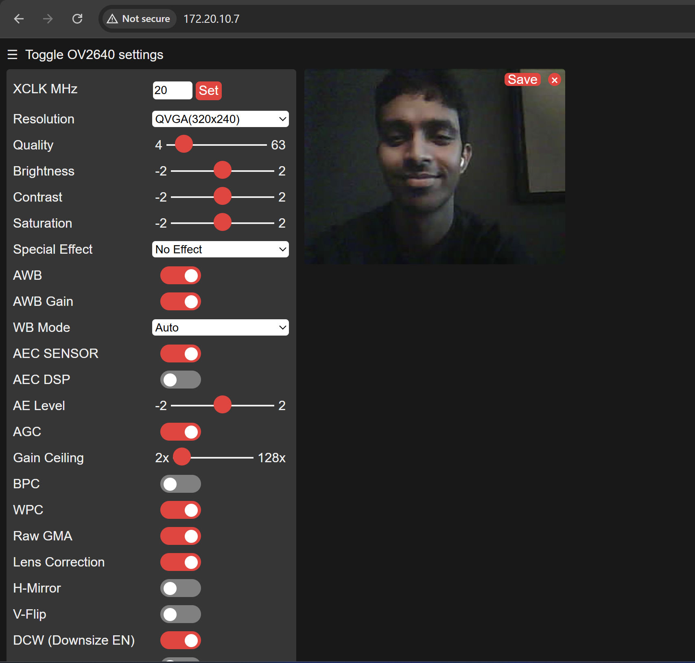
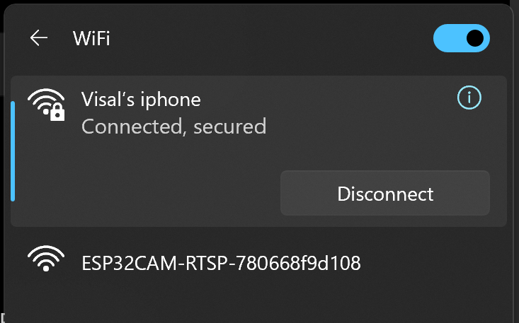
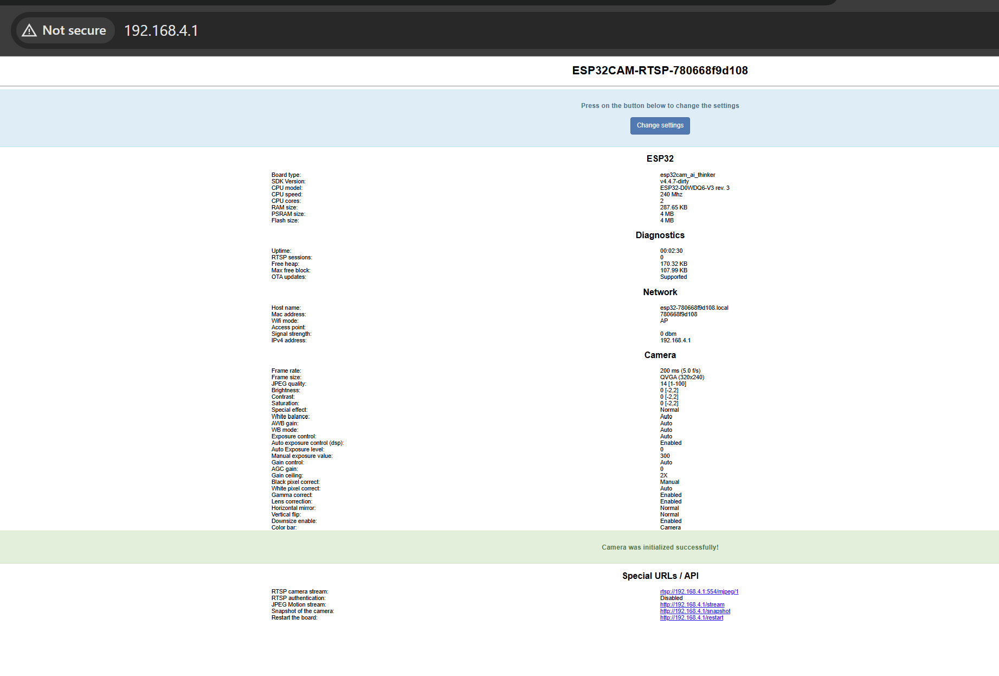
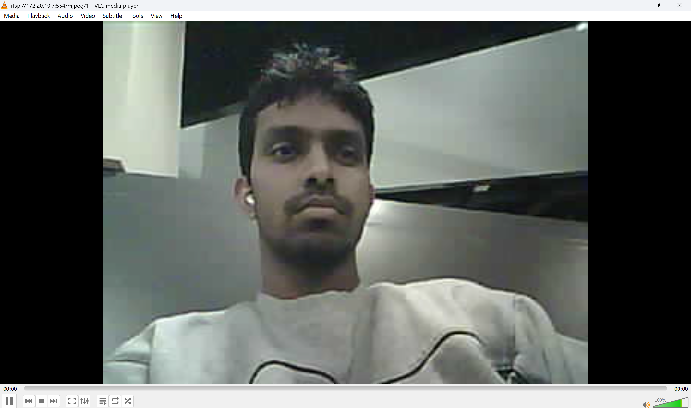

# ESP32-CAM RTSP Performance Testing

Performance evaluation of multiple ESP32-CAM devices
in an RTSP streaming system.

## Hardware

- ESP32-CAM
- OV2640 camera
- ESP32-CAM-MB programmer/development board

## Development Setup

- Arduino IDE 2.3.10
- ESP32 board package by Espressif Systems
- Board configuration: AI Thinker ESP32-CAM
- Serial baud rate: 115200
- Camera model: OV2640
- Wi-Fi: 2.4 GHz

## Progress

### Stage 1 - Basic camera setup
- [x] Install development environment
- [x] Connect ESP32-CAM
- [x] Upload test firmware
- [x] Connect ESP32-CAM to Wi-Fi
- [x] Get IP address
- [x] View camera stream in browser

### Stage 2 - RTSP
- [x] Connect one camera to RTSP system
- [x] View stream using RTSP client

### Stage 3 - Multiple cameras
- [ ] Two cameras
- [ ] Three cameras
- [ ] Four cameras

### Stage 4 - Performance testing
- [ ] FPS
- [ ] Latency
- [ ] Bandwidth
- [ ] Stability

## Basic Camera Test

The ESP32-CAM was first tested using a simple Arduino sketch to verify that firmware could be uploaded and serial communication was working. The sketch is available in `firmware/basic_test/basic_test.ino`.

After restarting the ESP32, the Serial Monitor at 115200 baud displayed: 

`ESP32 is working!`

After the initial test, the `CameraWebServer`example included with the ESP32 Arduino package was used to test the OV2640 camera and Wi-Fi connectivity.

The ESP32-CAM was configured using the `CAMERA_MODEL_AI_THINKER` camera configuration and aconnected to a 2.4 GHz Wi-Fi network.

After successfull establishment of connection, the ESP32-CAM received a local IP address. The camera web interface was accessed from the  laptop connected to the same network. 

Live video from the OV2640 camera was successfully viewed in the browser. This confirmed that the ESP32-CAM, OV2640 camera, Wi-Fi connection and video straming were functioning correclty beofre beginning RTSP testing.

*Figure 1. Live video from the OV2640 camera displayed through the ESP32
CameraWebServer interface.*

## RTSP Setup and Test

After confirming that the ESP32-CAM, OV2640 camera and Wi-Fi connection were working, RTSP streaming was tested using the open-source [ESP32CAM-RTSP](https://github.com/rzeldent/esp32cam-rtsp) project.

Visual Studio Code with the PlatformIO extension was used to build and upload the RTSP frimware. The PlatformIO environment `esp32cam_ai_thinker` was selected for the ESP32-CAM.

The firmware was successfully built and uploaded to the ESP32-CAM.

After restarting the ESP32-CAM, the firmware created its own Wi-Fi access point:

`ESP32CAM-RTSP-780668f9d108`

The access point could then be found from the available Wi-Fi networks on the laptop.

*Figure 2. ESP32CAM-RTSP access point visible in the available Wi-Fi networks.*

The laptop was then connected to the ESP32-CAM accesspoint and the configuration page was opened at:

`http://192.168.4.1`

*Figure 3. ESP32CAM-RTSP status page after connecting directly to the ESP32-CAM access point.*

The status page confirmed that:

- Board type was `esp32cam_ai_thinker`
- PSRAM size was 4 MB
- Flash size was 4 MB
- The camera initialized successfully

The initial camera settings were kept at their default values:

- Resolution: QVGA (320×240)
- Frame duration: 200 ms (5 FPS)
- JPEG quality: 14
- Frame buffers: 2

The ESP32-CAM was then configured to connect to the local Wi-Fi hotspot:

`Visal’s iphone` by entering the SSID and corresponding password.

After applying the configuration and restarting the ESP32-CAM, the device successfully connected to the hotspot and received the IP address:

`172.20.10.7`

The Serial Monitor also confirmed that the RTSP server was listening on TCP port 554.

### Testing the RTSP stream

The computer and ESP32-CAM were connected to the same Wi-Fi network.

VLC Media Player was used as the RTSP client.

The following network stream was opened in VLC:

`rtsp://172.20.10.7:554/mjpeg/1`

The live camera video was successfully displayed in VLC.

This confirmed that the ESP32-CAM could operate as an RTSP streaming camera and that the first single-camera RTSP setup was working correctly.

## Troubleshooting and Challenges

Connecting one ESP32-CAM to the laptop, programming it, connecting to Wi-Fi and seeing live video in browser.

### ESP32-CAM upload fails with "No serial data received"

**Problem**

When uploading firmware through Arduino IDE, compilation completed successfully, but the upload failed with:

> Failed to connect to ESP32: No serial data received.

The correct COM port was selected and the ESP32-CAM was connected through USB.

**Solution**

The ESP32 needed to be placed into flashing/download mode manually following these steps.

1. Hold the **FLASH** button.
2. Press and release the **RST** button.
3. Keep **FLASH** pressed briefly.
4. Release **FLASH**.
5. Upload the sketch from Arduino IDE.

After entering flashing mode correctly, the firmware uploaded successfully.

**Verification**

The Serial Monitor was opened at **115200 baud** and the **RST** button was pressed.

The ESP32 successfully printed:

`ESP32 is working!`

---

### ESP32-CAM does not connect to iPhone hotspot

**Problem**

After configuring the ESP32-CAM to connect to an iPhone hotspot, the Serial Monitor continuously displayed:

`WiFi connecting................................`

The ESP32-CAM did not initially connect to the hotspot.

**Solution**

The laptop network information showed that the iPhone hotspot was operating on the 5 GHz Wi-Fi band. Since the ESP32 uses 2.4 GHz Wi-Fi, **Maximize Compatibility** was enabled in the iPhone Personal Hotspot settings.

The `WiFiScan` example in Arduino IDE was also used to check whether the ESP32 could detect the hotspot.

The ESP32 successfully detected:

`Visal’s iphone | -45 dBm | Channel 6 | WPA2`

This confirmed that the ESP32 Wi-Fi and antenna were working and that the hotspot was available on a compatible network.

The exact hotspot SSID and password were then used in the CameraWebServer program.

**Verification**

After uploading and restarting the ESP32-CAM, the Serial Monitor displayed:

`WiFi connecting...`

`WiFi connected`

`Camera Ready! Use 'http://172.20.10.7' to connect`

The ESP32-CAM was successfully connected to the iPhone hotspot.

---

### Old Serial Monitor output caused misleading camera error

**Problem**

While testing the CameraWebServer program, the Serial Monitor showed the following errors:

> Detected camera not supported.

> Camera probe failed with error 0x106 (ESP_ERR_NOT_SUPPORTED)

> Camera init failed with error 0x106

This initially appeared to indicate a problem with the OV2640 camera or the ESP32-CAM configuration.

**Solution**

The camera was confirmed to be an **OV2640**, and `CAMERA_MODEL_AI_THINKER` was correctly selected in the CameraWebServer configuration.

The Serial Monitor was then cleared before running the ESP32-CAM again. It was discovered that the previous camera errors were old output remaining from earlier runs and were being confused with the current output.

Clearing the Serial Monitor made it possible to observe only the messages from the latest boot.

**Verification**

After clearing the Serial Monitor and restarting the ESP32-CAM, the output showed:

`WiFi connecting...`

`WiFi connected`

`Camera Ready! Use 'http://172.20.10.7' to connect`

Opening the IP address in the browser successfully displayed the **ESP32 OV2640 camera web interface**.

This showed that the camera and CameraWebServer were working correctly.
